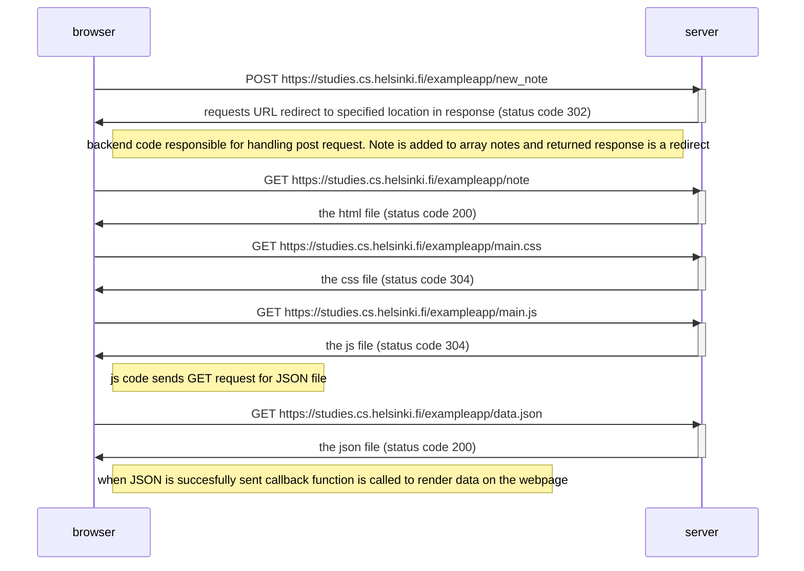

```mermaid
sequenceDiagram
  participant browser
  participant server
    
  browser->>server: POST https://studies.cs.helsinki.fi/exampleapp/new_note
  activate server
  server->>browser: requests URL redirect to specified location in response (status code 302)
  deactivate server
  
  note left of server: backend code responsible for handling post request. Note is added to array notes and returned response is a redirect
  
  browser->>server: GET https://studies.cs.helsinki.fi/exampleapp/note
  activate server
  server->>browser: the html file (status code 200)
  deactivate server
  
  browser->>server: GET https://studies.cs.helsinki.fi/exampleapp/main.css
  activate server
  server->>browser: the css file (status code 304)
  deactivate server
  
  browser->>server: GET https://studies.cs.helsinki.fi/exampleapp/main.js
  activate server
  server->>browser: the js file (status code 304)
  deactivate server
  
  note right of browser: js code sends GET request for JSON file
  
  browser->>server: GET https://studies.cs.helsinki.fi/exampleapp/data.json
  activate server
  server->>browser: the json file (status code 200)
  deactivate server
  
  note right of browser: when JSON is succesfully sent callback function is called to render data on the webpage
  

```
